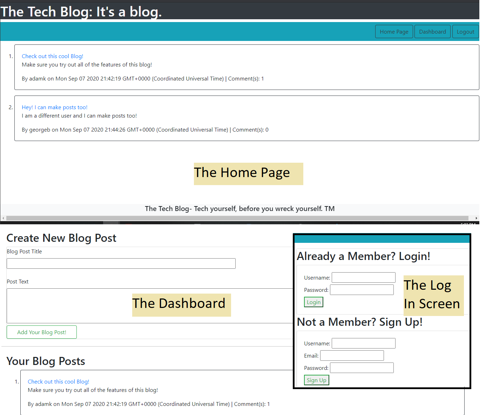

# mod14challenge
A CMS-style blog site similar to a Wordpress site, where developers can publish their blog posts and comment on other developers’ posts as well.

## Description: 
This is a simple blog site that is ismilar to Word Press. You can do all sorts of things on it!

* When you visit the site for the first time you can see the homepage, which includes existing blog posts and a navigation link for you to log in. 
* After navigating to the login page, the user can sign up using the form their. After signing up, you are immediatelly logged in! If you are a returning user, you would type your username and password to sign in.
* When you are logged in, more navigation buttons will appear on the Navbar.
* When a user clicks on an existing blog post title, they are taken to a page that shows the post title, contents, post creator’s username, and date created for that post. Users also have the option to leave a comment!
* Clicking on the dashboard button will allow the user to make a new post, as well as see all of their existing posts!
* At the dashboard, a user can also edit and delete any of the posts they want!
* To log out, click the log out button on the navbar. OR you could simply wait 5 minutes doing nothing and the page will log out for you!

## Screenshot of Generated Webpage

## About the Project:
This project follows the CMV format:

### Controllers
The controllers for this project are a series of API routes that allow the server and the front-end to communicate with each other. The app uses sequelize to create mysql commands that get, post, update, and delete all of the things that you would need to.

### Models
The models for this project are posts, comments, and users. Each time a user/comment/post is created or modified, it uses these models.

### Views
The front-end of this project uses the Handlebars template engine to create template HTML code that can be plugged in where necessary. Posts and comments are dynamically added in this way. The application also uses Bootstrap for its front-end styling.

## Checkout the App on Heroku!:
[Don't forget to try out the app using Heroku!](https://calm-garden-95272.herokuapp.com/)
